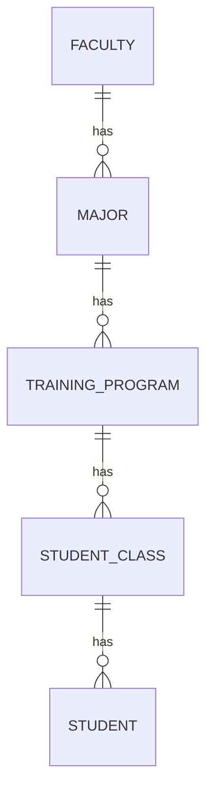

# Quan hệ khoa – ngành – chương trình – lớp – sinh viên



Các khóa ngoại `ManyToOne` ở phía con thể hiện quan hệ một-nhiều: nhiều ngành có thể
cùng `faculty_id`, nhiều chương trình
có thể cùng `major_id`, nhiều lớp có thể cùng `program_id`, nhiều sinh viên cùng `class_id`.
Không cần thêm collection `OneToMany` vào entity cha để tạo được quan hệ này.
`StudentClass` là lớp quản lý sinh viên, không phải lớp học phần.

## Quy tắc API

1. Tạo khoa: `POST /api/faculties`.
2. Tạo ngành: `POST /api/majors`, bắt buộc `facultyId` đã tồn tại.
3. Tạo chương trình: `POST /api/training-programs`, bắt buộc `majorId` đã tồn tại.
4. Tạo lớp: `POST /api/classes`, bắt buộc `programId` đã tồn tại. Backend lấy ngành từ chương trình.
5. Tạo sinh viên: `POST /api/students`, bắt buộc `classId` đã tồn tại. Backend lấy cả ngành
   và chương trình chính từ lớp. Khoa, ngành, chương trình và lớp đều phải đang hoạt động.

Ví dụ tối thiểu (thay ID bằng kết quả tạo thực tế):

```json
{ "shortCode": "IT", "name": "Khoa Công nghệ thông tin", "active": true }
```

```json
{ "shortCode": "IT", "name": "Công nghệ thông tin", "facultyId": 1, "active": true }
```

```json
{ "name": "Chương trình CNTT 2026", "majorId": 1, "cohort": 2026, "degreeType": "ENGINEER", "active": true }
```

```json
{ "name": "Lớp 26T1", "programId": 1, "active": true }
```

```json
{ "fullName": "Nguyễn Văn An", "classId": 1 }
```

Response lớp vẫn có `majorId`, `programId`; chi tiết sinh viên vẫn có `majorId`, `classId`,
`trainingProgramId`. Để tương thích request cũ, `majorId` của lớp/sinh viên và
`trainingProgramId` của sinh viên vẫn được nhận nếu khớp với quan hệ suy ra; sai trả `400`.
Không cần gửi những ID này. Nếu bỏ trống hoặc gửi null, backend vẫn tự suy ra khi POST/PUT.

PUT lớp không được bỏ `programId`. PUT sinh viên không được bỏ `classId`; thay lớp sẽ
cập nhật đồng thời ngành và chương trình chính. Có thể sửa thông tin của sinh viên đang
ở danh mục ngừng hoạt động, nhưng chuyển sang lớp khác phải chọn cả chuỗi đang hoạt động.

Lớp đã có sinh viên không được đổi chương trình (kể cả chương trình khác cùng ngành).
Muốn đổi, chuyển sinh viên sang lớp phù hợp trước. Chương trình đã được lớp/sinh viên
tham chiếu không được đổi ngành. Các trường hợp này trả `409`.

`secondaryProgramId` là thông tin chương trình phụ đã có từ trước, vẫn tùy chọn và
phải tham chiếu chương trình hợp lệ. Nó không thay thế hay quyết định chương trình chính của lớp.

## Database hiện có

Schema mới bắt buộc `classes.program_id` và `students.training_program_id` là NOT NULL.
Các cột ngành/chương trình lưu sẵn được giữ để tương thích; API luôn gán chúng từ chuỗi cha.
Khóa ngoại bảo đảm tồn tại bản ghi cha; quy tắc khớp ngành/chương trình được kiểm tra ở service.
Không chỉnh riêng các cột liên kết bằng SQL mà bỏ qua chuỗi quan hệ.

Nếu database đã có dữ liệu cũ, dừng backend và kiểm tra các truy vấn sau trước khi chạy
phiên bản mới. Không trông chờ `ddl-auto=update` tự sửa dữ liệu thiếu hoặc chọn chương trình.

Lớp thiếu chương trình hoặc sai ngành:

```sql
SELECT c.id, c.class_code, c.major_id, c.program_id, p.major_id AS program_major_id
FROM public.classes c
LEFT JOIN public.training_programs p ON p.id = c.program_id
LEFT JOIN public.majors m ON m.id = p.major_id
WHERE p.id IS NULL OR m.id IS NULL OR c.major_id IS DISTINCT FROM p.major_id;
```

Sinh viên có liên kết mâu thuẫn:

```sql
SELECT s.id, s.student_code, s.class_id, s.major_id, s.training_program_id,
       c.major_id AS class_major_id, c.program_id AS class_program_id
FROM public.students s
LEFT JOIN public.classes c ON c.id = s.class_id
WHERE c.id IS NULL OR s.major_id IS DISTINCT FROM c.major_id
   OR (s.training_program_id IS NOT NULL AND s.training_program_id IS DISTINCT FROM c.program_id);
```

Với lớp thiếu chương trình, chọn/tạo một chương trình đúng ngành rồi gán ID chính xác
cho lớp. Với sinh viên có liên kết mâu thuẫn, xác định lại lớp đúng và cập nhật đồng bộ
cả lớp, ngành, chương trình theo dữ liệu thực tế. Không tự đoán chương trình hoặc xóa dữ liệu.

Sau khi các truy vấn trên không còn kết quả, chạy toàn bộ
[script chuyển đổi](sql/001_require_academic_hierarchy.sql) trong DBeaver trên database sinh viên.
Script chạy trong một transaction, kiểm tra lại dữ liệu, chỉ điền chương trình chính còn
NULL theo lớp, rồi thêm NOT NULL. Nếu gặp mâu thuẫn, script dừng và không áp dụng thay đổi.
Script có thể chạy lại; không tạo lại bảng, không xóa hồ sơ.

Sau đó thực hiện phần bổ sung khoa/bằng cấp bên dưới trước khi khởi động backend.
Database mới tạo trực tiếp từ entity sẽ có các ràng buộc mới.
Script PostgreSQL là thao tác triển khai thủ công, chưa tự động chạy bởi ứng dụng.


## Bổ sung khoa và chuyển DegreeType sang enum trên database cũ

Giữ backend dừng trong quá trình chuyển đổi. Không tự gán tất cả ngành vào một khoa giả.

1. Chạy [002_prepare_faculties_and_program_fields.sql](sql/002_prepare_faculties_and_program_fields.sql).
   Script tạo bảng `faculties`, cột `majors.faculty_id` tạm cho phép NULL và bốn cột số mới.
2. Thêm các khoa thật và gán từng ngành vào khoa đúng. Ví dụ minh họa trong DBeaver:

```sql
INSERT INTO public.faculties (faculty_code, faculty_name, active)
VALUES ('K_CNTT', 'Khoa Công nghệ thông tin', TRUE)
RETURNING id;
-- Dùng ID thật vừa trả về và đúng mã ngành của bạn:
-- UPDATE public.majors SET faculty_id = <id_khoa> WHERE major_code = '<ma_nganh>';
```

3. Kiểm tra còn ngành chưa gán khoa và các giá trị bằng cấp cũ:

```sql
SELECT id, major_code, faculty_id FROM public.majors WHERE faculty_id IS NULL;
SELECT DISTINCT degree_type FROM public.training_programs WHERE degree_type IS NOT NULL;
```

Chủ động đổi các giá trị bằng cấp cũ sang tên enum đúng. Ví dụ nếu dữ liệu đang lưu
`Kỹ sư`, ánh xạ thành `ENGINEER`; `Cử nhân` thành `BACHELOR`; `Thạc sĩ` thành `MASTER`.
Giá trị khác cần xác nhận ý nghĩa trước, không tự xóa hoặc đoán. `degreeType` vẫn cho phép
null. Các cột học kỳ/tín chỉ mới cũng cho phép null để bổ sung sau bằng API.

4. Chạy [003_require_faculties_and_degree_types.sql](sql/003_require_faculties_and_degree_types.sql).
   Script từ chối nếu còn ngành không có khoa hợp lệ, enum lạ hoặc số liệu tín chỉ sai;
   sau đó thêm FK khoa, NOT NULL cho `faculty_id` và CHECK cho enum.
5. Khởi động backend và tạo/sửa chương trình với `degreeType` là `BACHELOR`, `ENGINEER`,
   `MASTER`; ví dụ `numberOfSemesters=10`, `totalCredits=150`, `requiredCredits=120`, `electiveCredits=30`.

Các script được lưu để triển khai thủ công, chưa chạy trên PostgreSQL của bạn.

### Ràng buộc học kỳ và tín chỉ tại database

Chạy [004_validate_program_academic_numbers.sql](sql/004_validate_program_academic_numbers.sql)
sau bước 003 để thêm CHECK cho database hiện có. Script không sửa dữ liệu; nếu có
dữ liệu không hợp lệ, migration thất bại và cần sửa dữ liệu trước khi chạy lại.
Database tạo mới bằng Hibernate có CHECK tương ứng trong entity.

`numberOfSemesters > 0`; cả ba số tín chỉ phải không âm. Từng thành phần không
vượt tổng, và khi có đủ ba giá trị thì `requiredCredits + electiveCredits = totalCredits`.
Các trường vẫn cho phép null để bổ sung sau. `programCode` và `majorCode` vẫn
unique ở database và được kiểm tra trùng (sau trim) khi tạo/cập nhật qua API.

Danh mục mẫu [Khoa Cơ khí](MECHANICAL_CATALOG.md) dùng mã custom và `variantCode`
để phân biệt chương trình thường/CLC/HTDN/tài năng cùng ngành, khóa và loại bằng.
